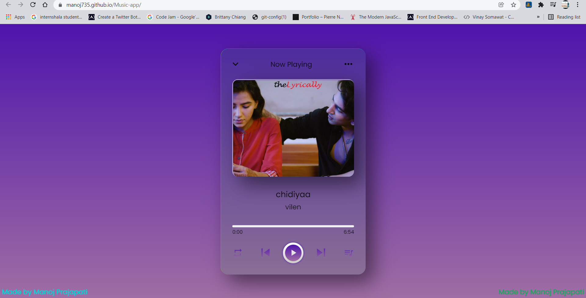
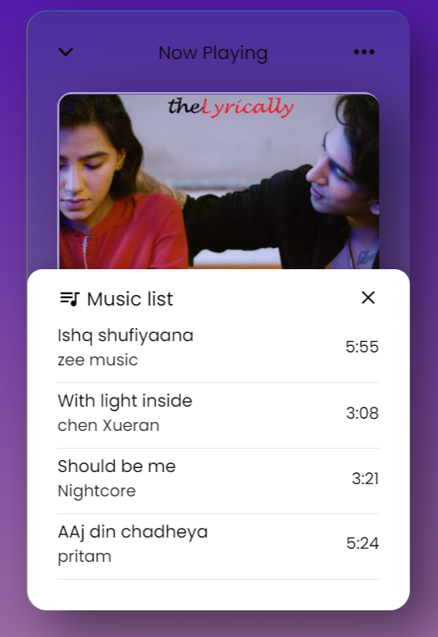

# MusicApp

>  A Music Player developed using JavaScript, CSS, and HTML. Users can click the Forward play, Backward play, Playlist loop and Shuffle music buttons to change the songs.

## Live Demo

[Live Demo Link](https://manoj735.github.io/Music-app/) :point_left:

Landing Page:

Music List:

